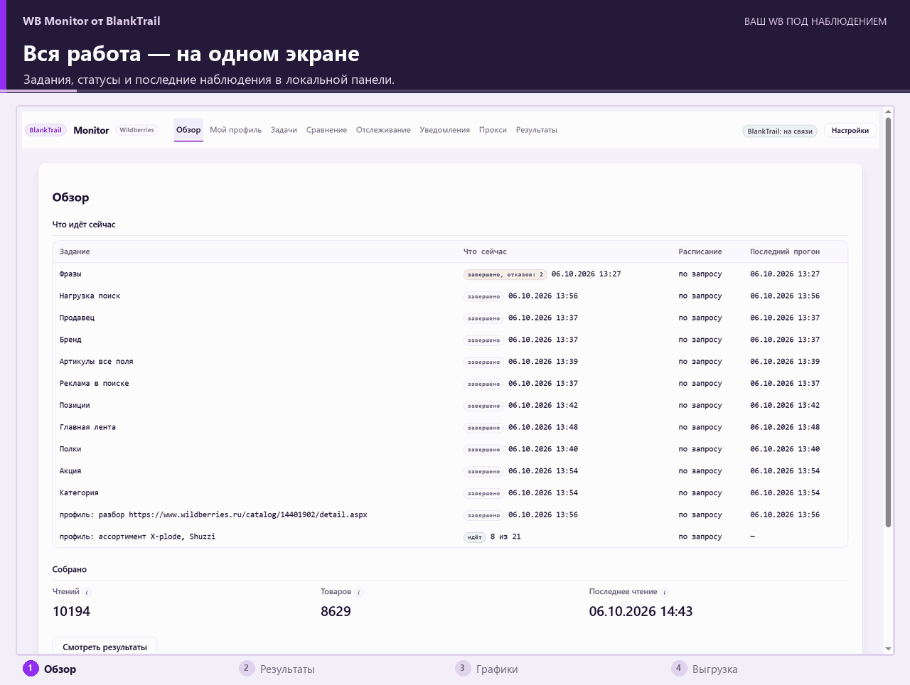
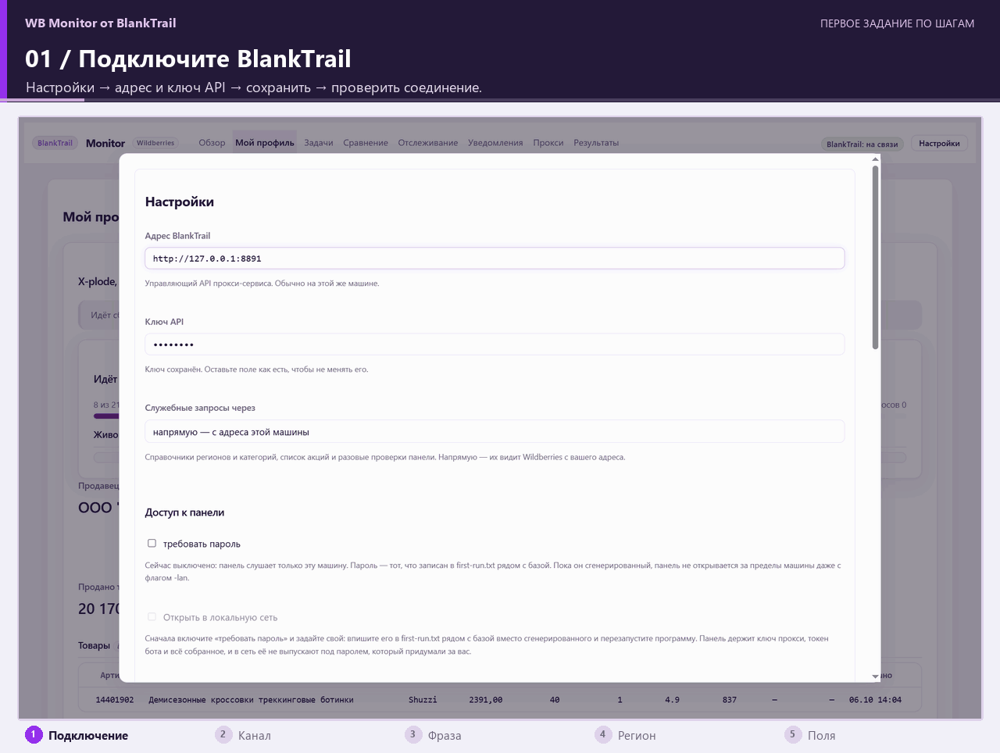
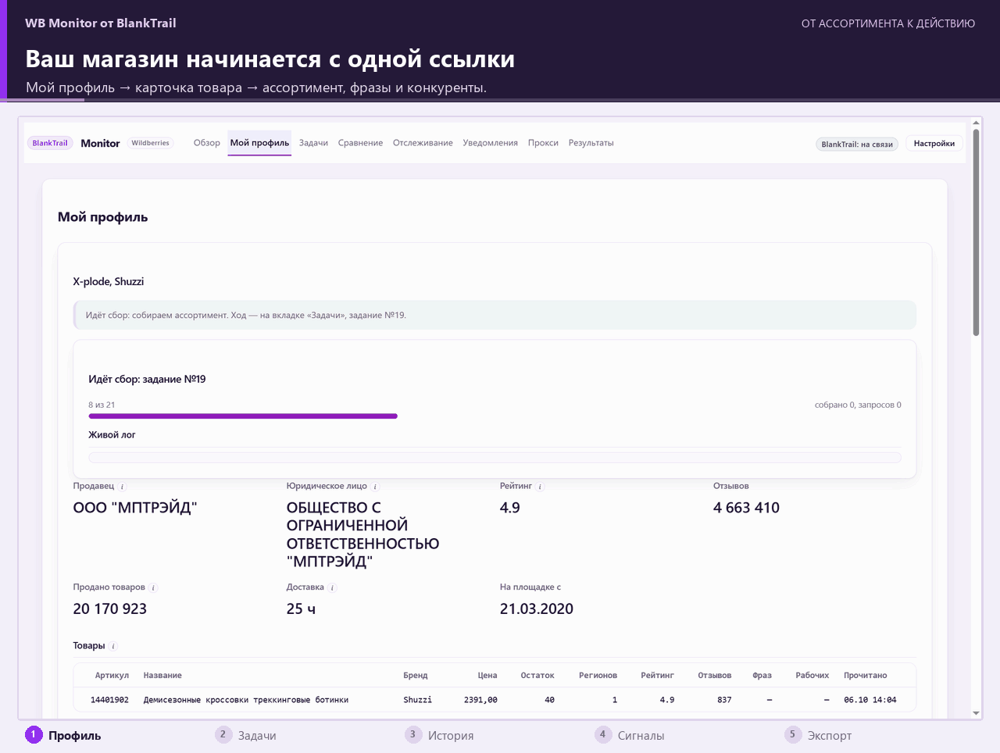

<div align="center">

# WB Monitor от BlankTrail — парсер Wildberries, мониторинг цен, позиций и остатков

**Ваши товары. Ваши конкуренты. Изменения, которые важно заметить вовремя.**

**WB Monitor от BlankTrail** собирает публичные данные Wildberries по расписанию,<br>
сохраняет историю на вашем компьютере и показывает её в понятной веб-панели.

[](https://github.com/BlankTrail/wildberries-monitor/releases/latest/download/wbmon_windows_amd64.zip)
[](https://github.com/BlankTrail/wildberries-monitor/releases/latest)
[](LICENSE)

**Поисковая выдача · Цены конкурентов · Остатки по складам · Telegram · Excel**

</div>

> **Без входа в ваш кабинет Wildberries.** WB Monitor работает только с публично доступными данными. Не нужны API-ключи WB, логин, пароль или другая авторизация в кабинете продавца. Ключ BlankTrail используется только для подключения к прокси-службе.

> **Сбор работает после изменений антибота WB в сентябре 2026 года — по данным команды проекта на 7 октября 2026.** Для доступа к Wildberries нужен **BlankTrail Proxy с лицензией, включающей Challenge Breaker**. Сам монитор распространяется без платы за лицензию; BlankTrail и каналы выхода подключаются отдельно. [Подробнее о работе с антиботом →](#парсинг-wildberries-после-изменений-антибота-в-сентябре-2026)



<p align="center"><sub>GIF-обзоры собраны из реальных скриншотов интерфейса. Подписи поясняют экраны; показанные товары и значения — примеры из сохранённых снимков.</sub></p>

Полный размер: [обзор](docs/img/panel-overview.png) · [таблица результатов](docs/img/panel-results.png).

<p align="center">
<a href="#что-получит-селлер-wb">Возможности</a> ·
<a href="#быстрый-старт">Быстрый старт</a> ·
<a href="#первое-задание-от-фразы-до-таблицы">Первое задание</a> ·
<a href="#парсинг-wildberries-после-изменений-антибота-в-сентябре-2026">Антибот WB</a> ·
<a href="#вопросы-перед-запуском">Вопросы и ответы</a> ·
<a href="docs/GUIDE.md">Полное руководство</a>
</p>

## Что получит селлер WB

Проверять десятки карточек вручную неудобно. Монитор собирает наблюдения за вас: кто поднялся в поиске, у кого изменилась цена, где заканчивается товар и как выглядит ваше предложение рядом с конкурентами.

| Ваша задача | Что показывает программа | Где смотреть |
|---|---|---|
| Следить за SEO карточки на Wildberries | Позиции артикула по ключевым фразам, история и вход/выход из топа | **Отслеживание**, **Результаты** |
| Замечать изменения цен конкурентов | Цены, скидки, история и уведомления по заданным порогам | **Сравнение**, **Уведомления** |
| Контролировать наличие | Остатки по размерам и складам, исчезновение товара и возвращение в наличие | **Результаты**, **Уведомления** |
| Видеть различия между городами | Цены, доступные склады, доставка и выдача для выбранных регионов | **Результаты** |
| Разобраться со своим ассортиментом | Продавец по ссылке на карточку, товары, подбор фраз и поиск конкурентов | **Мой профиль** |
| Следить за рекламой и акциями | Рекламная выдача по фразе, состав акций и рекомендательные полки | **Задачи**, **Результаты** |
| Передать данные менеджеру или аналитику | Выгрузка выбранных полей в Excel, CSV, JSON или базу | **Результаты → Выгрузить** |

**История принадлежит вам.** Данные и настройки хранятся в локальной SQLite-базе. Веб-панель открывается в вашем браузере, по умолчанию — только на вашем компьютере. Telegram и Google Таблицы подключаются по желанию.

## Быстрый старт

Для первого знакомства не нужно писать код или устанавливать Go. Нужны готовый архив программы, запущенный BlankTrail с Challenge Breaker и компьютер, который будет включён во время сбора.

### 1. Скачайте программу

| Ваша система | Архив |
|---|---|
| **Windows 10/11, Intel или AMD** | **[Скачать для Windows](https://github.com/BlankTrail/wildberries-monitor/releases/latest/download/wbmon_windows_amd64.zip)** |
| Windows, ARM64 | [wbmon_windows_arm64.zip](https://github.com/BlankTrail/wildberries-monitor/releases/latest/download/wbmon_windows_arm64.zip) |
| macOS, Apple Silicon | [wbmon_darwin_arm64.tar.gz](https://github.com/BlankTrail/wildberries-monitor/releases/latest/download/wbmon_darwin_arm64.tar.gz) |
| macOS, Intel | [wbmon_darwin_amd64.tar.gz](https://github.com/BlankTrail/wildberries-monitor/releases/latest/download/wbmon_darwin_amd64.tar.gz) |
| Linux, x86-64 | [wbmon_linux_amd64.tar.gz](https://github.com/BlankTrail/wildberries-monitor/releases/latest/download/wbmon_linux_amd64.tar.gz) |
| Linux, ARM64 | [wbmon_linux_arm64.tar.gz](https://github.com/BlankTrail/wildberries-monitor/releases/latest/download/wbmon_linux_arm64.tar.gz) |

[Все релизы и изменения](https://github.com/BlankTrail/wildberries-monitor/releases) · [Контрольные суммы SHA256](https://github.com/BlankTrail/wildberries-monitor/releases/latest/download/SHA256SUMS)

### 2. Распакуйте и запустите

**Windows:** распакуйте архив, например в `C:\wbmon`, и запустите `start.bat`. Держите окно программы открытым, пока идёт сбор. Для повседневной работы используйте `wbmon-tray.exe`: программа работает со значком возле часов.

**macOS и Linux:** распакуйте архив, откройте терминал в распакованной папке и выполните `./start.sh`. [Подробная установка, включая первый запуск на macOS →](docs/GUIDE.md#2-распакуйте-и-запустите)

Панель откроется по адресу **[http://127.0.0.1:8760/](http://127.0.0.1:8760/)**. Если браузер не открылся автоматически, введите этот адрес вручную.

### 3. Подключите BlankTrail

1. Запустите **[BlankTrail Proxy](https://github.com/BlankTrail)** с лицензией, включающей **Challenge Breaker**.
2. В мониторе откройте **Настройки**, укажите адрес BlankTrail и его ключ API. Для локальной установки обычный адрес — `http://127.0.0.1:8891`.
3. Нажмите **Сохранить → Проверить соединение**. Дождитесь **«BlankTrail: на связи»**; доступность лицензии и источников проверяется перед сбором.
4. На вкладке **Прокси** выберите канал выхода. Начать можно с **«Прямого соединения»** через BlankTrail; для большего объёма подключите свои прокси или шлюзы.

**Готово к первой проверке:** панель открыта, BlankTrail отвечает, канал выбран. Теперь создайте небольшое задание по одной фразе.

## Первое задание: от фразы до таблицы

Начните с запроса, по которому покупатель должен находить ваш товар, например `платье летнее`. Один запрос и один регион помогут быстро понять результат.



1. Откройте **Задачи → Добавить задание**. Назовите его, например «Мои позиции — Москва».
2. Выберите **«Поисковая выдача по фразе»**. Впишите ключевой запрос; несколько фраз задаются по одной в строке.
3. Выберите **регион и пункт выдачи**. Если справочник пуст, нажмите **«Обновить справочник»**. Укажите свой канал выхода.
4. Для первого запуска возьмите **1–3 страницы**, **4 потока**, основные поля и расписание **«по запросу»**. Под формой увидите оценку количества запросов.
5. Нажмите **Сохранить задание → Запустить**. Ход сбора виден в **Задачах**; кнопка **Подробнее** открывает лог и причины отказов.
6. Откройте **Результаты**: найдите свой артикул, посмотрите позицию, цену и соседние товары. При необходимости выгрузите таблицу в **XLSX**.

Чтобы данные обновлялись сами, задайте интервал, например **`every 3h`**. После повторных сборов появится история для сравнения и графиков. Компьютер и BlankTrail должны работать в часы запуска заданий.

**Как понять, что всё получилось:** задание завершилось, в **Результатах** появились товары с датой наблюдения и выбранным регионом. Если есть отказы, их количество видно в статусе; детали доступны в логе.

## Три сценария для ежедневной работы

### Найти свои товары и конкурентов по одной ссылке

Откройте **Мой профиль**, вставьте ссылку на свою карточку Wildberries и нажмите **Разобрать ссылку**. Программа определит продавца и запустит цепочку: ассортимент → ключевые фразы → позиции → конкуренты.

Фразы можно поправить, конкурентов — закрепить или исключить. В **Сравнении** ваши товары оказываются рядом с конкурентами по цене, позиции, рейтингу и наполнению карточки. Для большого магазина сбор может занять часы; прогресс виден в панели.

[Подробнее о профиле и сравнении →](docs/GUIDE.md#мой-профиль-всё-о-своём-магазине-одной-кнопкой)

### Следить за ценами и позициями без ручных проверок

Настройте регулярный сбор и откройте **Отслеживание** по артикулу. Графики покажут историю цены и места в поисковой выдаче по фразам. Если наблюдений за период нет, на графике будет разрыв.

Создайте правило в **Уведомлениях**, например «цена изменилась больше чем на 5%» или «товар вышел из топа». У правил есть пороги, тихие часы и защита от повторов. Для доставки уведомлений подключите своего Telegram-бота.



[Настройка Telegram по шагам →](docs/GUIDE.md#уведомления-и-telegram)

### Собирать остатки и сравнивать регионы

Добавьте в задание несколько регионов и поля **«Склад»**, **«Остаток по размеру»**. В **Результатах** клик по остатку откроет разбивку, а клик по цене — сравнение цен по регионам.

**Знак `≥` означает «не меньше».** Wildberries ограничивает отображаемые остатки: `≥38` — это 38 штук или больше. Монитор отмечает такие значения и учитывает изменение потолка, чтобы оно само по себе не выглядело падением остатка.

Вкладка **Продажи** оценивает изменения по истории остатков. Это оценка наблюдаемых снижений, а не отчёт из кабинета: поставки, перемещения и ограничения WB влияют на полноту и интерпретацию данных.

[Как читать остатки](docs/GUIDE.md#шаг-5-смотрите-результаты) · [Как считается оценка продаж](docs/GUIDE.md#продажи-оценка-по-остаткам)

## Что можно собрать с Wildberries

| Источник | Для чего использовать |
|---|---|
| **Поиск по ключевым фразам** | Анализ выдачи, конкурентов и ценового окружения |
| **Позиции товаров по фразам** | Мониторинг позиций WB и оценка изменений SEO карточки |
| **Категория, продавец, бренд** | Сбор ассортимента и исследование ниши |
| **Список артикулов** | Наблюдение за своими товарами и выбранными конкурентами |
| **Реклама по фразе** | Наблюдение за рекламной выдачей |
| **Акции, главная страница, полки** | Состав акций и дополнительные места показа товаров |

Можно выбирать поля: **название, артикул, бренд, продавец, цена, скидка, рейтинг, отзывы, позиция, остатки, размеры, склады, доставка, описание, характеристики, вопросы и ответы**. Доступность конкретного поля зависит от источника.

Основные данные из выдачи не требуют дополнительных запросов. Подробности карточки и отзывы увеличивают объём сбора — форма показывает оценку заранее. Здесь «стоимость» означает количество запросов; расход прокси зависит от вашего провайдера.

[Все виды заданий и группы полей →](docs/GUIDE.md#что-программа-собирает)

## Выгрузка в Excel, CSV и Google Таблицы

Отфильтруйте результаты, выберите колонки и сохраните данные в удобном формате.

| Формат | Когда пригодится |
|---|---|
| **XLSX / CSV** | Отчёты селлеру, менеджеру и работа в Excel |
| **Google Таблицы** | Совместная работа; нужен ваш OAuth-клиент Google |
| **JSON / JSONL** | Обработка скриптами и интеграции |
| **SQLite / SQL** | Аналитика в базе и передача разработчику |

[Подробнее об экспорте →](docs/GUIDE.md#выгрузка-данных)

## Парсинг Wildberries после изменений антибота в сентябре 2026

**По сообщению команды проекта, WB Monitor продолжает собирать данные после усложнения антибот-защиты WB в сентябре 2026 года.** Дата последней проверки, указанная командой: **7 октября 2026 года**. Сбор выполнялся через BlankTrail с Challenge Breaker.

В результатах проверки перечислены **позиции по фразам, рекомендательные полки, рекламная выдача и карточки с остатками по складам в двух регионах**. Числа по отдельным прогонам сохранены в [полном руководстве](docs/GUIDE.md#работа-после-ужесточения-защиты-wb). Исходные логи к документации не приложены; это сведения команды о конкретной проверке.

В программе предусмотрены проверка лицензии перед сбором, повторные попытки через доступные каналы и исключение неработающих прокси. Статус задания показывает отказы и частично собранные данные — результат можно проверить в логе.

**Если ваш парсер WB перестал работать после обновления защиты**, начните с небольшого задания по одной фразе и одному региону. Так вы проверите связку монитора, BlankTrail и своих каналов на нужных вам данных. Успех предыдущего прогона не гарантирует доступность всех источников после следующих изменений Wildberries.

## Вопросы перед запуском

### Нужен ли API-ключ кабинета продавца Wildberries?

Нет. Монитор работает **только с публично доступными данными** и не входит в ваш кабинет продавца. **API-ключи Wildberries, логин, пароль, токены и авторизация в кабинете не требуются.** Для подключения к прокси-службе нужен только **ключ API BlankTrail** — он не даёт доступа к вашему кабинету WB.

### Это бесплатная аналитика Wildberries?

Сам **WB Monitor — открытая программа без платы за лицензию**. Для сбора нужен отдельный BlankTrail с Challenge Breaker; расходы на него и прокси зависят от выбранных условий. Эти компоненты не входят в архив монитора.

### Работает ли парсер Wildberries без BlankTrail?

Для поддерживаемого сбора требуется **BlankTrail с Challenge Breaker**. «Прямое соединение» в списке каналов означает выход с адреса вашего компьютера через BlankTrail.

### Можно ли проверять позиции товаров на WB по регионам?

Да. Регион задаётся в задании. Сравнивайте наблюдения в одинаковых условиях: фраза, регион, глубина выдачи и время сбора. Позиция отражает полученную выдачу; конкретный покупатель может увидеть другой порядок товаров.

### Покажет ли программа точные продажи конкурента?

Она оценивает продажи по изменениям доступных остатков. Это не подтверждённые заказы, выкупы или финансовый отчёт. Значения с потолком помечаются `≥`, а неопределённые интервалы — `?`.

### Нужно ли держать компьютер включённым?

Да, в часы сбора. Можно включить **Автозапуск** в настройках; для постоянной работы на Linux и macOS в архиве есть файлы службы. [Автозапуск, база и резервная копия →](docs/GUIDE.md#автозапуск-и-работа-сутками)

### Что делать, если BlankTrail не отвечает или есть отказы?

Проверьте адрес и ключ в **Настройках**, выполните **Проверить соединение**, затем проверьте канал на вкладке **Прокси**. В **Задачах → Подробнее** найдите причину отказа. [Разбор типовых проблем →](docs/GUIDE.md#если-что-то-не-так)

## Для разработчиков

Нужен **Go 1.26**. CGO не используется. Сборка из корня репозитория:

```bash
go build ./cmd/wbmon
go test ./...
```

Windows, приложение со значком в трее без окна консоли:

```powershell
go build -ldflags "-H windowsgui" -o wbmon-tray.exe ./cmd/wbmon-tray
```

Библиотеки: [`blanktrail`](https://github.com/BlankTrail/wildberries-monitor/tree/main/blanktrail) — клиент прокси-службы, [`wb`](https://github.com/BlankTrail/wildberries-monitor/tree/main/wb) — получение данных Wildberries. [Примеры использования](https://github.com/BlankTrail/wildberries-monitor/tree/main/docs/examples) · [Подробности сборки](docs/GUIDE.md#сборка-из-исходников)

## Поддержка и лицензия

Нашли проблему? [Создайте issue](https://github.com/BlankTrail/wildberries-monitor/issues): укажите версию, систему, тип задания и обезличенный фрагмент лога. Ключи API, токены бота и адреса прокси с паролями удалите перед публикацией.

Код распространяется по **AGPL-3.0-or-later**: [LICENSE](LICENSE), [NOTICE](NOTICE). Программа поставляется «как есть»; доступность данных зависит от Wildberries и подключённых компонентов. [Условия использования из руководства](docs/GUIDE.md#правовая-оговорка).

---

<div align="center">

**Начните с одной фразы. Найдите свой товар. Настройте регулярное наблюдение.**

**[Скачать WB Monitor](https://github.com/BlankTrail/wildberries-monitor/releases/latest)** · **[Открыть руководство](docs/GUIDE.md)**

Если проект полезен — поставьте ⭐ на GitHub: так другим селлерам будет проще его найти.

</div>
