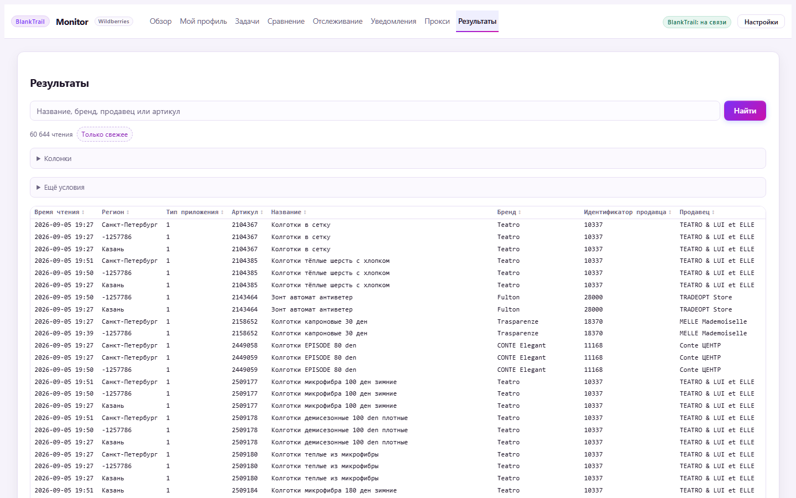
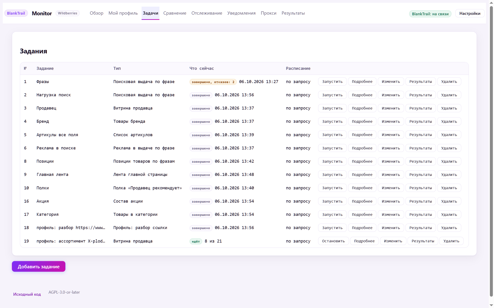

# Парсер Wildberries: мониторинг цен, позиций и остатков

**wildberries-monitor** — программа для сбора и анализа данных с Wildberries.
Она сама, по расписанию, обходит поисковую выдачу, категории, витрины продавцов
и карточки товаров, складывает всё в базу на вашем компьютере и показывает в
веб-панели: как менялась цена, где товар стоит в поиске по ключевым словам, что
с остатками и рейтингом, что делают конкуренты.

Это не облачный сервис и не подписка: программа работает на вашем компьютере,
база лежит там же, данные никуда не уходят.



---

## Оглавление

- [Что нужно знать до установки](#что-нужно-знать-до-установки)
- [Быстрый старт](#быстрый-старт)
- [Что программа собирает](#что-программа-собирает)
- [Экраны панели](#экраны-панели)
- [Выгрузка данных](#выгрузка-данных)
- [Уведомления и Telegram](#уведомления-и-telegram)
- [Автозапуск](#автозапуск)
- [Сборка из исходников](#сборка-из-исходников)
- [Лицензия](#лицензия)
- [Правовая оговорка](#правовая-оговорка)

---

## Что нужно знать до установки

Читайте этот раздел до того, как что-то скачаете.

**Программа работает только через [BlankTrail Proxy](https://github.com/BlankTrail).**
Wildberries закрыт JS-проверкой: обычный HTTP-запрос до данных не доходит.
Нужна лицензия BlankTrail с модулем Challenge Breaker. Без неё запросы не
пройдут вообще — это не «работает хуже», а «не работает».

**Что ещё понадобится:**

- Компьютер, который будет включён в моменты сбора. Ноутбук в спящем режиме
  ничего не соберёт.
- Прокси или VPN-шлюзы, если собираете помногу. Для десятка товаров хватит
  прямого соединения, для тысяч — нет.
- Немного терпения на первую настройку: сбор не начнётся, пока не пройдёт
  проверка соединения с BlankTrail.

**Чего программа не делает:** не заходит в ваш личный кабинет продавца, не
знает ваших продаж и себестоимости, ничего не меняет на Wildberries. Она только
читает то, что и так видно любому покупателю.

---

## Быстрый старт

### 1. Скачайте свою версию

| Система | Файл |
|---|---|
| **Windows 10/11** (обычный компьютер) | [wbmon_windows_amd64.zip](https://github.com/BlankTrail/wildberries-monitor/releases/latest/download/wbmon_windows_amd64.zip) |
| Windows на ARM | [wbmon_windows_arm64.zip](https://github.com/BlankTrail/wildberries-monitor/releases/latest/download/wbmon_windows_arm64.zip) |
| macOS, Apple Silicon (M1–M4) | [wbmon_darwin_arm64.tar.gz](https://github.com/BlankTrail/wildberries-monitor/releases/latest/download/wbmon_darwin_arm64.tar.gz) |
| macOS, Intel | [wbmon_darwin_amd64.tar.gz](https://github.com/BlankTrail/wildberries-monitor/releases/latest/download/wbmon_darwin_amd64.tar.gz) |
| Linux, x86-64 | [wbmon_linux_amd64.tar.gz](https://github.com/BlankTrail/wildberries-monitor/releases/latest/download/wbmon_linux_amd64.tar.gz) |
| Linux, ARM64 | [wbmon_linux_arm64.tar.gz](https://github.com/BlankTrail/wildberries-monitor/releases/latest/download/wbmon_linux_arm64.tar.gz) |

Ссылки всегда ведут на самую свежую версию. Проверить, что файл скачался
целиком, можно по [SHA256SUMS](https://github.com/BlankTrail/wildberries-monitor/releases/latest/download/SHA256SUMS).

### 2. Распакуйте и запустите

Распакуйте архив в любую папку — например, `C:\wbmon`. Не запускайте прямо из
архива: программе нужно место для базы данных.

- **Windows:** двойной клик по `start.bat`. Откроется браузер с панелью.
  Рядом лежит `wbmon-tray.exe` — то же самое, но без чёрного окна консоли и со
  значком в трее; его удобнее ставить в автозапуск.
- **macOS и Linux:** `./start.sh` в терминале.

Панель открывается на `http://127.0.0.1:8760/` и доступна только с этого
компьютера.

### 3. Подключите BlankTrail

В панели откройте **Настройки**, впишите адрес BlankTrail (обычно
`http://127.0.0.1:8891`) и API-ключ, нажмите **Проверить соединение**. Пока
проверка не прошла, сбор не запустится — и это специально, чтобы вы не ждали
результатов от задания, которое всё равно ничего не соберёт.

### 4. Выберите регион

Все цены, остатки и позиции на Wildberries **разные в разных городах**. Регион
передаётся кодом, справочника этих кодов сайт не публикует, поэтому программа
собирает его сама из пунктов выдачи.

Откройте **Задачи → Добавить задание**, в поле регионов выберите область,
город и пункт выдачи — или возьмите сразу все 85 региональных центров. Один раз
выбранный код сохраняется.

### 5. Создайте первое задание

Самое простое, с чего начать, — посмотреть выдачу по своей ключевой фразе:

1. **Задачи → Добавить задание**
2. Тип: **Поисковая выдача по фразе**
3. Фразы: впишите по одной в строке, например `колготки женские`
4. Страниц: 3 (примерно 300 товаров)
5. Поля: галочка **Основное** уже стоит — этого достаточно для первого раза
6. **Сохранить**, затем **Запустить**

Экран сразу покажет, сколько запросов задание потратит, ещё до запуска.
Результаты появятся на вкладке **Результаты**.

---

## Что программа собирает

### Виды заданий

Задание — это «что обойти». Их одиннадцать, и они закрывают разные вопросы.



| Тип задания | Отвечает на вопрос |
|---|---|
| Поисковая выдача по фразе | Кто стоит в топе по моему запросу и на каком месте |
| Товары в категории | Что вообще есть в этой категории каталога |
| Витрина продавца | Весь ассортимент конкурента — по его артикулу |
| Товары бренда | Все товары бренда |
| Список артикулов | Мои товары (или чужие) — цены, остатки, рейтинг |
| Позиции товаров по фразам | Где именно мои артикулы стоят по списку ключевых слов |
| Реклама в выдаче по фразе | Кто выкупает рекламные места по запросу |
| Состав акции | Какие товары попали в акцию |
| Лента главной страницы | Что Wildberries показывает на главной |
| Полка «Продавец рекомендует» | Что продавец подвешивает под свою карточку |
| Профиль: разбор ссылки | Служебное — цепочка «мой профиль» заводит его сама |

### Какие данные снимаются

Сорок полей, разбитых на группы. Группы важны, потому что от них зависит цена
сбора в запросах:

| Группа | Что внутри | Стоимость |
|---|---|---|
| **Основное** | Название, бренд, продавец, цена со скидкой и без, скидка, рейтинг, число отзывов, место в выдаче, страница | бесплатно — едет вместе со страницей |
| **Остатки** | Общий остаток, размеры, остаток по размеру, склад | бесплатно |
| **Доставка** | Сроки доставки, удалённость склада | бесплатно |
| **Акция** | Промо-метка, участие в акции | бесплатно |
| **Фото и видео** | Число фотографий | бесплатно |
| **Карточка** | Описание, артикул продавца, категория, состав, дата создания карточки | +2 запроса на товар |
| **Отзывы и вопросы** | Оценка, число отзывов, тексты отзывов и вопросов, ответы продавца | +2 запроса на товар |
| **Реклама по фразе** | Позиция и артикул рекламной выдачи | +1 запрос на фразу |

Отметили дорогую группу — экран пересчитает стоимость задания до запуска.
Тысяча товаров с отзывами — это две тысячи дополнительных запросов, а если
отметить ещё и карточку, то четыре. Лучше узнать об этом до старта, а не по
счёту за прокси.

---

## Экраны панели

**Обзор** — что собрано и что происходит прямо сейчас.

**Мой профиль** — вставьте ссылку на свою карточку, и программа сама пройдёт
цепочку: определит продавца, соберёт весь ваш ассортимент, подберёт ключевые
фразы под каждый товар, проверит по ним позиции и найдёт, кто стоит рядом.
Одна кнопка вместо пяти заданий.

**Задачи** — список заданий: что идёт, чем закончилось прошлое, кнопки
«Запустить», «Остановить», «Изменить». Расписание — любой интервал от минуты
(`every 3h`, `every 24h`); пусто — значит только по кнопке.

**Сравнение** — ваши товары рядом с конкурентами по одним и тем же фразам:
цена, полнота карточки, число фотографий, рейтинг.

**Отслеживание** — два графика на товар: цена со скидкой и место в выдаче по
каждой фразе. За неделю, месяц или год. Если в какой-то день никто ничего не
собирал, линия рвётся, а не рисует ровную полку — вы видите, где данных нет.

**Уведомления** — правила: о чём вас предупредить. Цена упала больше чем на
5%, остаток ниже десяти, товар вылетел из топ-10, пропал размер, изменился
рейтинг. Условия складываются: «упала больше 5% и при этом остаток меньше
десяти». Есть тихие часы и защита от повторов.

**Прокси** — через что ходить: список прокси из файла или по ссылке,
ротируемый адрес, VPN-шлюзы BlankTrail, прямое соединение — в любом сочетании.
Каждый канал можно проверить, не потратив ни одного платного запроса.

**Результаты** — таблица собранного с поиском, сортировкой по колонкам,
фильтрами и выбором колонок. Отсюда же выгрузка.

---

## Выгрузка данных

Одна и та же выборка полей даёт одинаковые колонки в любом формате:

| Формат | Для чего |
|---|---|
| **CSV** | Открыть в Excel или Google Таблицах |
| **XLSX** | Готовый файл Excel |
| **JSON**, **JSONL** | Отдать программисту или скрипту |
| **SQLite** | Один файл базы, который можно открыть чем угодно |
| **SQL** | Дамп для PostgreSQL или MySQL |
| **Google Таблицы** | Прямо в таблицу, по вашему OAuth-клиенту |

Выгрузка потоковая — миллион строк не съест память. Исключение одно: файл
SQLite приходится дописывать с начала, поэтому он собирается целиком. Проверено
на 58 тысячах строк в 33 колонки: 15 МБ за три секунды.

Для Google Таблиц нужен ваш собственный OAuth-клиент: в репозитории нет ничьих
учётных данных и не будет.

---

## Уведомления и Telegram

Правила шлют уведомления в Telegram. Бот умеет не только принимать их:

| Команда | Что делает |
|---|---|
| `/jobs` | Список заданий и что сейчас идёт |
| `/run`, `/stop` | Запустить или остановить задание |
| `/track`, `/untrack`, `/tracked` | Поставить товар или фразу под наблюдение |
| `/card` | Карточка товара: цена, скидка, рейтинг, остаток |
| `/chart` | График цены или позиции картинкой |
| `/export` | Выгрузка файлом в любом формате |
| `/status` | Что с программой прямо сейчас |

Если `api.telegram.org` у вас заблокирован, программа пойдёт через ваш порт
BlankTrail, а если и это не выйдет — через MTProto. Экран настроек показывает,
какой путь сейчас рабочий.

---

## Автозапуск

Два способа, для разных случаев.

**Галочка «Автозапуск» в настройках** — для обычного компьютера или ноутбука.
Программа сама пропишется в автозагрузку того пользователя, под которым вы её
отметили.

**Служба** — для компьютера, в который никто не логинится. В архиве лежат
`wbmon.service` (Linux) и `com.blanktrail.wbmon.plist` (macOS); внутри каждого
файла написано, куда его класть. С `loginctl enable-linger` сбор переживёт
перезагрузку без открытой сессии.

Полезные ключи запуска:

```
wbmon -port 8760          порт панели
wbmon -data D:\wbmon      где держать базу
wbmon -open=false         не открывать браузер (для службы)
wbmon -lan                открыть панель в локальную сеть
wbmon -version            какая это версия
```

База по умолчанию лежит в системной папке приложения
(`%LOCALAPPDATA%\BlankTrail\wbmon` на Windows), а не рядом с программой —
чтобы обновление не затирало данные.

**Про пароль.** По умолчанию его нет, и это не забывчивость: панель слушает
только `127.0.0.1`, снаружи к ней не подключиться. Если компьютером пользуется
кто-то ещё — включите в настройках галочку «требовать пароль». Открыть панель в
сеть (`-lan`) программа не даст, пока пароль не включён и не заменён на свой.

---

## Сборка из исходников

Нужен Go 1.26. CGO не используется, поэтому собирается под все системы с одной
машины.

```
go build ./cmd/wbmon      программа
go test ./...             тесты
```

Для значка в трее без окна консоли:

```
go build -ldflags "-H windowsgui" -o wbmon-tray.exe ./cmd/wbmon-tray
```

В репозитории две библиотеки, которые можно использовать отдельно:
`blanktrail` — клиент прокси-службы, `wb` — чтение данных Wildberries.
Примеры запуска лежат в [docs/examples](docs/examples).

---

## Лицензия

AGPL-3.0-or-later. Полный текст — в [LICENSE](LICENSE), сведения об
использованных библиотеках — в [NOTICE](NOTICE).

Если вы запускаете эту программу для других людей по сети, статья 13 AGPL
обязывает вас предоставить им исходный код. В панели для этого есть ссылка на
репозиторий — не убирайте её.

---

## Правовая оговорка

Программа создана в образовательных и демонстрационных целях.

Автор не несёт никакой ответственности за её работоспособность, за последствия
её использования и за любые прямые или косвенные убытки, возникшие в связи с
ней. Программа поставляется «как есть», без каких-либо гарантий — явных или
подразумеваемых, включая гарантии пригодности для конкретной цели.

Претензии по работоспособности не принимаются. Wildberries может в любой момент
изменить свой сайт, и часть возможностей перестанет работать; это ожидаемое
поведение, а не дефект, за исправление которого кто-либо отвечает.

Вы используете программу на свой страх и риск и самостоятельно отвечаете за
соблюдение условий использования Wildberries и законодательства о персональных
данных. Отзывы покупателей содержат персональные данные реальных людей —
обращайтесь с выгруженными данными соответственно.

Проект не связан с ООО «Вайлдберриз», не аффилирован с ним и не одобрен им.
«Wildberries» — товарный знак правообладателя, используется здесь только для
указания на совместимость.
