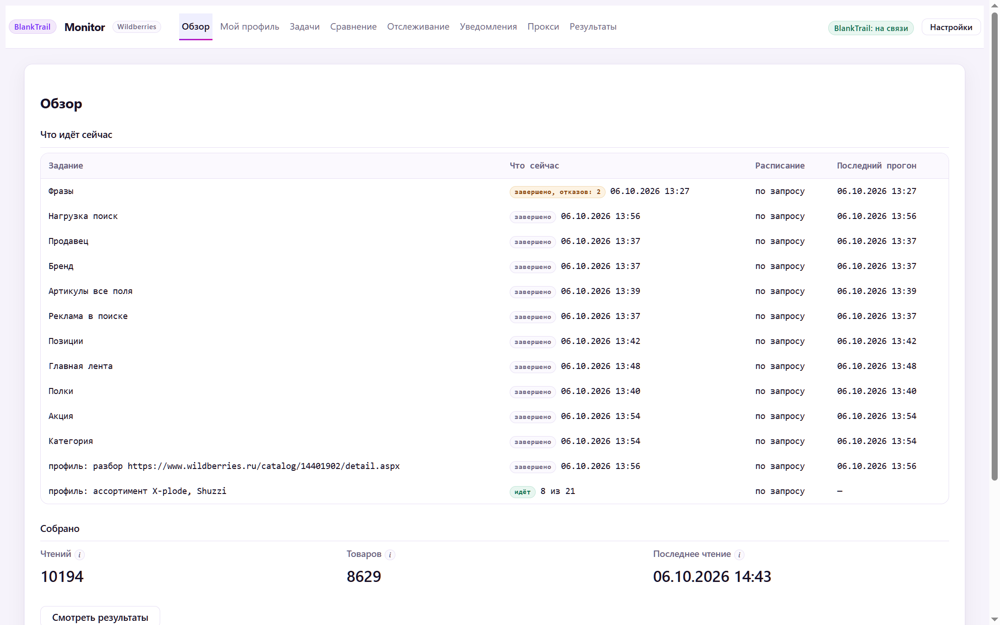
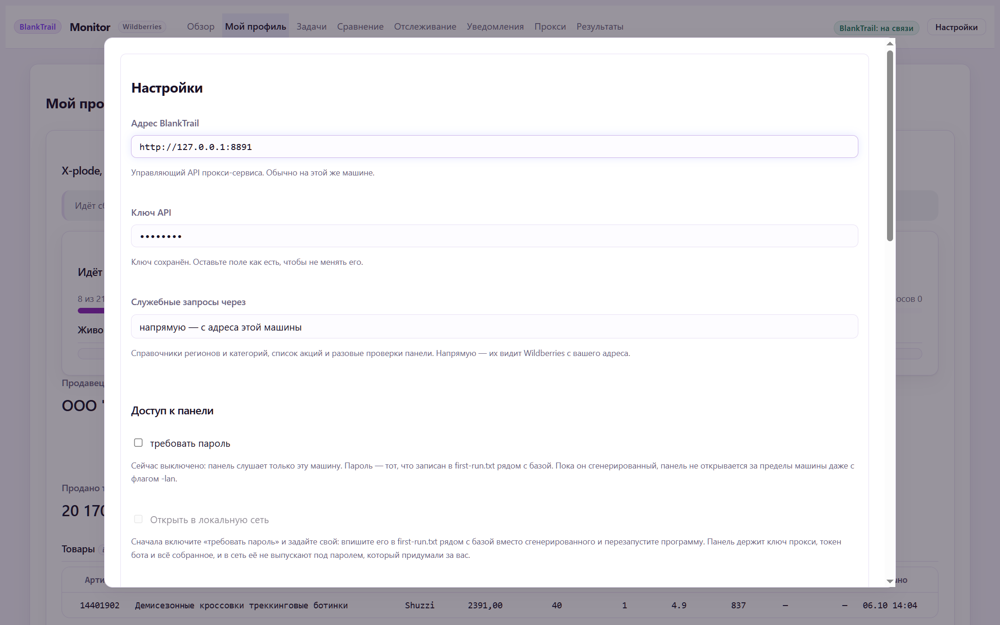
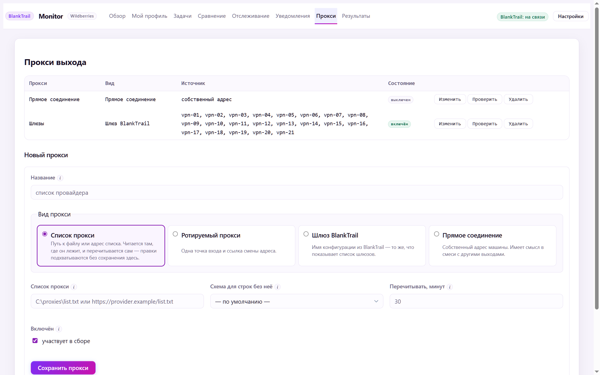
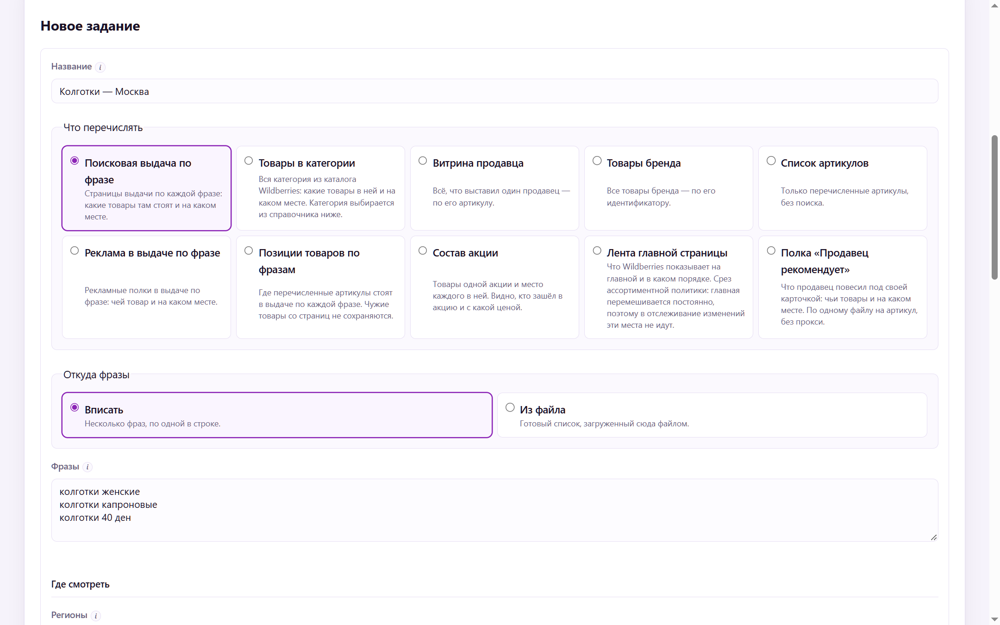
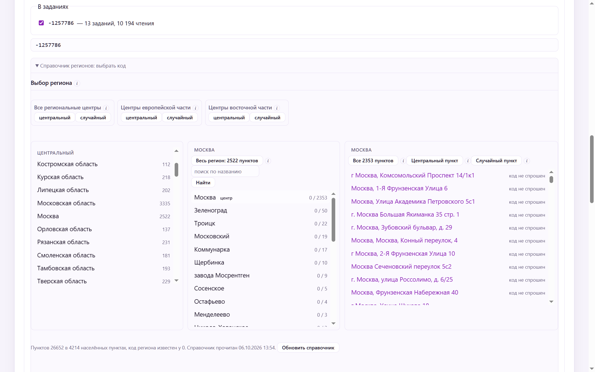
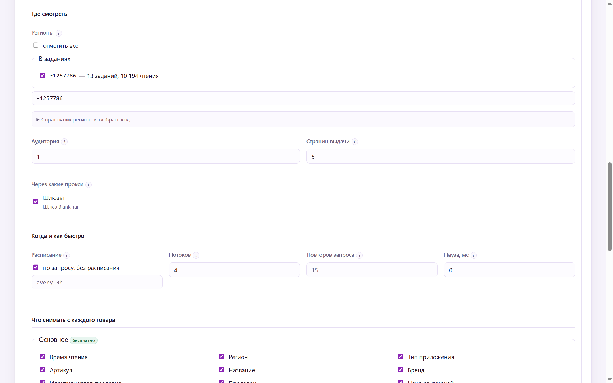
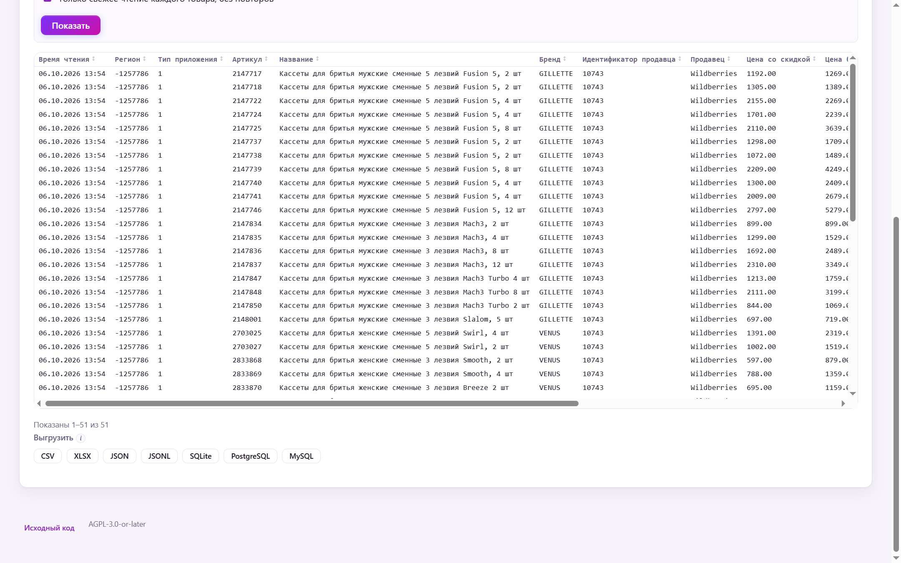
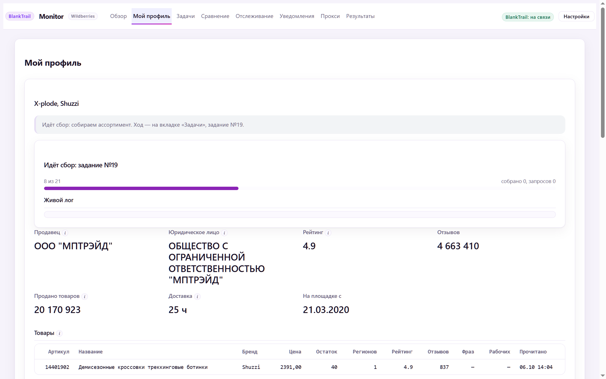
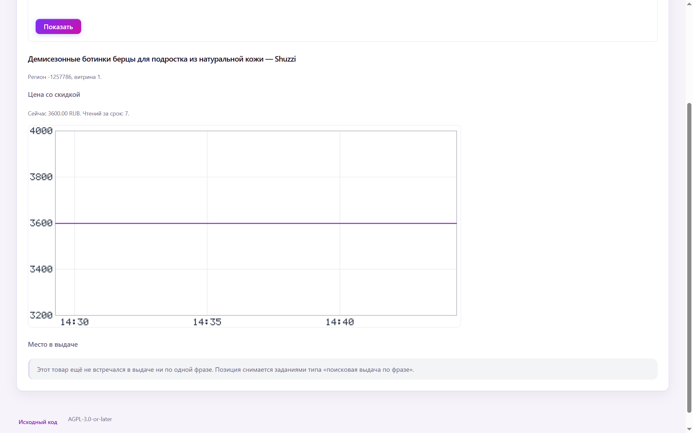
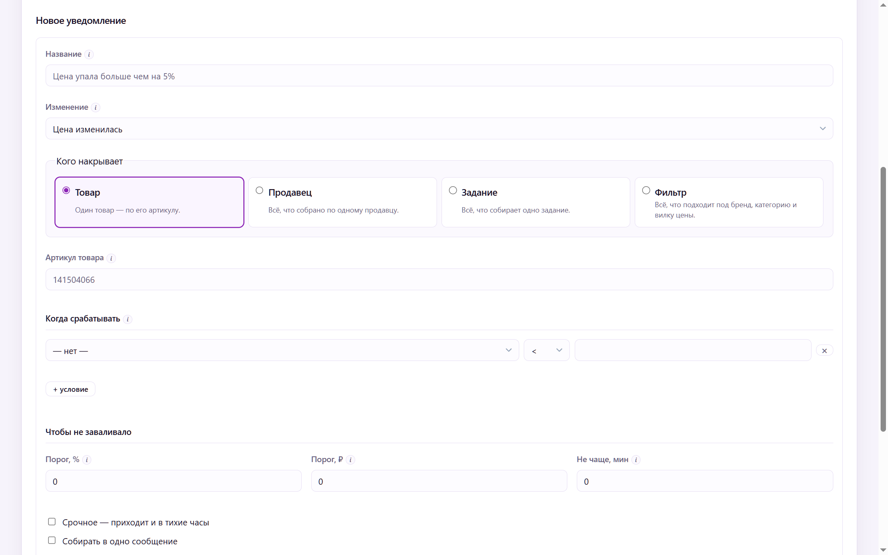

# WB Monitor от BlankTrail — руководство

**WB Monitor от BlankTrail** — парсер и монитор Wildberries для селлеров. Программа
сама, по расписанию, собирает данные с WB: поисковую выдачу по ключевым
словам, категории, витрины продавцов и брендов, карточки товаров, отзывы,
остатки по складам, акции. Всё складывается в базу на вашем компьютере и
показывается в веб-панели: как менялась цена, на каком месте товар стоит в
поиске, что с остатками и рейтингом, что делают конкуренты.

**Авторизация в кабинете Wildberries не требуется.** Монитор работает только
с публично доступными данными. Не нужны API-ключи WB, логин, пароль или токены
кабинета продавца. Ключ API BlankTrail нужен только для подключения к прокси-службе.

База и история хранятся на вашем компьютере. Сам монитор распространяется
без платы за лицензию; для сбора нужен отдельный BlankTrail с Challenge Breaker.
Telegram и Google Таблицы получают данные только при настроенной интеграции.

[Вернуться к README](../README.md) · [Скачать программу](https://github.com/BlankTrail/wildberries-monitor/releases/latest)



---

## Оглавление

- [Что нужно знать до установки](#что-нужно-знать-до-установки)
- [Установка и первый запуск](#установка-и-первый-запуск)
- [Пошагово: первое задание](#пошагово-первое-задание)
- [Мой профиль: всё о своём магазине одной кнопкой](#мой-профиль-всё-о-своём-магазине-одной-кнопкой)
- [Продажи: оценка по остаткам](#продажи-оценка-по-остаткам)
- [Отслеживание: графики цены и позиций](#отслеживание-графики-цены-и-позиций)
- [Уведомления и Telegram](#уведомления-и-telegram)
- [Что программа собирает](#что-программа-собирает)
- [Выгрузка данных](#выгрузка-данных)
- [Автозапуск и работа сутками](#автозапуск-и-работа-сутками)
- [Работа после ужесточения защиты WB](#работа-после-ужесточения-защиты-wb)
- [Если что-то не так](#если-что-то-не-так)
- [Сборка из исходников](#сборка-из-исходников)
- [Лицензия](#лицензия)
- [Правовая оговорка](#правовая-оговорка)

---

## Что нужно знать до установки

**Программа работает только через [BlankTrail Proxy](https://github.com/BlankTrail).**
Wildberries закрыт антибот-защитой: обычный HTTP-запрос до данных не доходит.
Нужна лицензия BlankTrail с модулем Challenge Breaker. Без неё запросы не
пройдут вообще — это не «работает хуже», а «не работает».

**Что ещё понадобится:**

- Компьютер, который будет включён в моменты сбора. Ноутбук в спящем режиме
  ничего не соберёт.
- Прокси или VPN-шлюзы, если собираете помногу. Для десятка товаров хватит
  прямого соединения, для тысяч — нет.
- Минут десять на первую настройку.

**Чего программа не делает:** не заходит в ваш личный кабинет продавца, не
знает ваших продаж и себестоимости, ничего не меняет на Wildberries. Она только
читает то, что и так видно любому покупателю на сайте.

---

## Установка и первый запуск

### 1. Скачайте архив для своей системы

| Система | Файл |
|---|---|
| **Windows 10/11** (обычный компьютер) | [wbmon_windows_amd64.zip](https://github.com/BlankTrail/wildberries-monitor/releases/latest/download/wbmon_windows_amd64.zip) |
| Windows на ARM | [wbmon_windows_arm64.zip](https://github.com/BlankTrail/wildberries-monitor/releases/latest/download/wbmon_windows_arm64.zip) |
| macOS, Apple Silicon (M1–M4) | [wbmon_darwin_arm64.tar.gz](https://github.com/BlankTrail/wildberries-monitor/releases/latest/download/wbmon_darwin_arm64.tar.gz) |
| macOS, Intel | [wbmon_darwin_amd64.tar.gz](https://github.com/BlankTrail/wildberries-monitor/releases/latest/download/wbmon_darwin_amd64.tar.gz) |
| Linux, x86-64 | [wbmon_linux_amd64.tar.gz](https://github.com/BlankTrail/wildberries-monitor/releases/latest/download/wbmon_linux_amd64.tar.gz) |
| Linux, ARM64 | [wbmon_linux_arm64.tar.gz](https://github.com/BlankTrail/wildberries-monitor/releases/latest/download/wbmon_linux_arm64.tar.gz) |

Ссылки всегда ведут на самую свежую версию. Не знаете, какой файл нужен, —
берите первый: это обычный компьютер с Windows. Проверить, что архив скачался
целиком, можно по [SHA256SUMS](https://github.com/BlankTrail/wildberries-monitor/releases/latest/download/SHA256SUMS).
Все версии и список изменений — на странице [релизов](https://github.com/BlankTrail/wildberries-monitor/releases).

### 2. Распакуйте и запустите

Распакуйте архив в любую папку, например `C:\wbmon`. Не запускайте прямо из
архива — Windows откроет программу во временной папке.

**Windows.** Двойной клик по `start.bat`. Откроется чёрное окно и браузер с
панелью. Окно не закрывайте: это и есть программа, а в окне видно, что она
делает.

Windows может показать синее окно «Windows защитила ваш компьютер» — программа
не подписана платным сертификатом. Нажмите **Подробнее → Выполнить в любом
случае**. Это нужно один раз.

Для повседневной работы рядом лежит `wbmon-tray.exe` — та же программа, но без
чёрного окна и со значком возле часов. Её удобно ставить в автозапуск.

**macOS.** Откройте «Терминал», перейдите в папку и запустите:

```bash
cd ~/Downloads/wbmon_darwin_arm64
xattr -d com.apple.quarantine wbmon
./start.sh
```

Вторая строка снимает с файла пометку «скачано из интернета» — без неё macOS
не даст запустить неподписанную программу.

**Linux.**

```bash
tar xzf wbmon_linux_amd64.tar.gz
cd wbmon_linux_amd64
./start.sh
```

Панель открывается в браузере по адресу `http://127.0.0.1:8760/`. Если браузер
не открылся сам — откройте этот адрес вручную. Панель доступна только с этого
компьютера.

### 3. Подключите BlankTrail

В панели нажмите **Настройки** (справа вверху). Впишите **адрес BlankTrail**
(обычно `http://127.0.0.1:8891`, если BlankTrail стоит на этом же компьютере) и
**ключ API** из BlankTrail. Нажмите **Сохранить**, затем прокрутите вниз и нажмите
**Проверить соединение**.



Когда всё в порядке, справа вверху загорается зелёная плашка
**«BlankTrail: на связи»**. Пока её нет, сбор не запустится — специально, чтобы
вы не ждали результатов от задания, которое всё равно ничего не соберёт.

### 4. Укажите, через что ходить на Wildberries

Откройте вкладку **Прокси**. По умолчанию там одна запись — «Прямое
соединение», то есть запросы идут с адреса вашего компьютера. Для первого
знакомства этого хватит. Для серьёзного сбора добавьте свой канал:

| Вид | Когда выбирать | Что вписать |
|---|---|---|
| **Список прокси** | У вас купленный список прокси | Путь к файлу (`C:\proxies\list.txt`) или ссылку на список у провайдера. Список перечитывается сам, по умолчанию каждые 30 минут |
| **Ротируемый прокси** | Один адрес, который провайдер меняет по ссылке | Адрес прокси и ссылку смены адреса |
| **Шлюз BlankTrail** | VPN-конфигурации, загруженные в сам BlankTrail | Отметьте галочками нужные шлюзы из списка |
| **Прямое соединение** | Немного запросов или в смеси с остальными | Ничего |



Кнопка **Проверить** рядом с каналом покажет, сколько адресов в нём живы, —
без запуска задания и без сбора. Неработающие шлюзы и прокси программа
во время сбора сама отбрасывает и переходит на другие, но лучше видеть их
заранее.

---

## Пошагово: первое задание

Самое простое, с чего начать, — посмотреть поисковую выдачу по своей ключевой
фразе: кто стоит в топе и на каком месте ваш товар.

### Шаг 1. Что собирать

Откройте **Задачи → Добавить задание**.

1. **Название** — любое, чтобы потом найти задание в списке.
2. **Что перечислять** — оставьте «Поисковая выдача по фразе».
3. **Фразы** — впишите ключевые запросы, по одному в строке. Готовый список
   можно загрузить файлом («Из файла»).



### Шаг 2. Где смотреть и как быстро

Ниже в той же форме:

- **Регионы.** Цены, остатки, сроки доставки и даже место в выдаче на
  Wildberries **разные в разных городах**. Откройте «Справочник регионов»,
  выберите область, город и пункт выдачи — или возьмите сразу «Все региональные
  центры». Справочник загружается кнопкой «Обновить справочник» за пару секунд.
- **Страниц выдачи** — сколько страниц по 100 товаров обойти. Для начала
  хватит 3–5.
- **Через какие прокси** — отметьте свой канал из шага 4.
- **Расписание** — оставьте «по запросу», если запускать будете кнопкой. Чтобы
  программа собирала сама, снимите галочку и впишите интервал: `every 3h`
  (каждые 3 часа), `every 24h` (раз в сутки).
- **Потоков** — сколько запросов идёт одновременно. 4 — разумное начало.





### Шаг 3. Какие данные снимать

Внизу формы — группы полей. Группа **«Основное»** уже отмечена и не требует дополнительных запросов:
название, бренд, продавец, цены, скидка, рейтинг, место в выдаче. Остатки,
доставка и акция тоже не требуют дополнительных запросов. Группы «Карточка» и
«Отзывы и вопросы» добавляют запросы на каждый товар (подробно — в таблице
[ниже](#какие-данные-снимаются)).

Под полями сразу видно, **сколько запросов и времени задание потратит** — ещё
до запуска. Нажмите **Сохранить задание**.

### Шаг 4. Запустите и смотрите ход

В списке заданий нажмите **Запустить**. Колонка «Что сейчас» покажет ход
(«идёт 7 из 15»), а **Подробнее** откроет живой лог: какие страницы собраны,
через какие порты, были ли отказы.


Значок после прогона говорит, чем всё закончилось:

| Значок | Что значит |
|---|---|
| **завершено** | Собрано всё |
| **завершено, отказов: N** | N страниц не удалось получить даже после повторов через другие прокси. Откройте «Подробнее» — там причина |
| **завершено, без части данных: N** | Страницы собраны, но часть дополнительных данных (например, отзывы) не пришла |
| **с ошибкой** | Прогон не состоялся вовсе — обычно нет связи с BlankTrail |

### Шаг 5. Смотрите результаты

Вкладка **Результаты** — таблица всего собранного. Строка поиска ищет по
названию, бренду, продавцу и артикулу. Клик по заголовку колонки — сортировка.
**«Ещё условия»** — фильтры по артикулам, бренду, региону и датам; галочка
«Только свежее» оставляет по одному, последнему чтению каждого товара. Набор
колонок настраивается в блоке **«Колонки»**.

Знак **«≥»** перед остатком значит, что это не точное число, а потолок:
Wildberries не показывает остаток больше определённого значения (осенью 2026
года — от 38 до 65, и потолок меняется в течение дня). «≥38» — товара 38 штук
или больше. Программа находит потолок сама, по выдаче, и не считает его сдвиг
изменением остатка: правило «остаток упал» не сработает оттого, что потолок
опустился с 50 до 38. А вот падение с «≥38» до 12 — настоящее, и о нём придёт
уведомление.

Клик по остатку в таблице открывает панель с двумя цифрами: что сообщает
Wildberries и сколько показывают склады собранных регионов (каждый склад
посчитан один раз). Склады упираются в потолок по отдельности, поэтому в сумме
часто дают больше: Wildberries пишет «≥37», а склады двух регионов — «≥643».
Панель берёт большее и пишет «товара не меньше 643». Чем больше регионов в
задании, тем выше может быть оценка. Для разбивки по складам отметьте в группе
«Остатки» поля «Склад» и «Остаток по размеру».

Клик по цене открывает **цены по регионам**. Продавец ставит одну цену, а
покупатель платит её за вычетом скидки Wildberries (СПП), и эта скидка в разных
регионах разная: одна и та же карточка стоит 977 ₽ в одном регионе и 980 ₽ в
другом. Панель кладёт регионы рядом, от дешёвого к дорогому, и показывает
разброс. Сравниваются только цены, снятые в пределах суток друг от друга, —
иначе это уже изменение цены во времени, а не разница регионов.


Под таблицей — выгрузка в любом формате. Выгружается ровно то, что вы
отфильтровали.



---

## Мой профиль: всё о своём магазине одной кнопкой

Вкладка **Мой профиль**. Вставьте ссылку на любую свою карточку — например
`https://www.wildberries.ru/catalog/14401902/detail.aspx` — и нажмите
**Разобрать ссылку**. Дальше программа сама пройдёт цепочку:

1. определит продавца и покажет его данные: рейтинг, число отзывов, сколько
   товаров продано, срок доставки, на площадке с какого года;
2. соберёт весь ваш ассортимент с ценами и остатками;
3. подберёт ключевые фразы под каждый товар из слов на карточках и подсказок
   поиска Wildberries;
4. проверит по ним позиции и найдёт, кто стоит рядом, — это ваши конкуренты.

Одна кнопка вместо пяти заданий. Цепочка большая: для магазина на несколько
тысяч товаров она идёт часами — прогресс виден на этой же странице и во вкладке
**Задачи**. Готовые фразы можно поправить вручную, а конкурентов — закрепить
или исключить.



Когда цепочка дойдёт до конкурентов, вкладка **Сравнение** поставит ваши товары
рядом с ними по одним и тем же фразам: цена, место в выдаче, полнота карточки,
число фотографий, рейтинг.

Там же — **возможные копии ваших товаров**: карточки других продавцов того же
предмета, у которых название совпадает с вашим хотя бы на 60% слов и не меньше
чем в четырёх словах (слова бренда не считаются), и которые Wildberries не
склеил с вашей карточкой. Короткое типовое название вроде «Кроссовки
демисезонные» копией не считается. Ищутся среди всего, что собрали задания:
чем шире задания по вашим фразам, тем больше видно. Это подсказка, а не
вердикт, — откройте карточку и проверьте глазами.

---

## Продажи: оценка по остаткам

Вкладка **Продажи** оценивает продажи по наблюдаемым снижениям остатков
между съёмками. Уменьшение остатка может быть связано и с перемещениями или
корректировками; это не подтверждённые заказы и выкупы из кабинета продавца.
Для каждого товара — оценка за день, неделю, две или месяц,
сколько в день и на какую сумму, по скольким съёмкам. Поиск — по названию,
бренду, продавцу или артикулу.

Где собрана разбивка по складам (поля «Склад» и «Остаток по размеру»), каждый
склад и размер считаются отдельно: поставка на один склад не прячет продажи с
другого, а строка склада ниже потолка Wildberries считается точно, даже когда
общий остаток упёрся в потолок. Склады из всех регионов задания складываются в
одну историю.

Это **оценка снизу**, и экран говорит об этом у каждой цифры:

- поставка между двумя съёмками прячет продажи до неё — чем чаще расписание,
  тем точнее;
- **«≥»** — часть продаж посчитана от потолка остатков, на деле их больше;
- **«?»** — остаток стоял на потолке и в начале, и в конце какого-то
  промежутка: сколько продали тогда, не видно.

---

## Отслеживание: графики цены и позиций

Вкладка **Отслеживание**. Внизу — товары, по которым уже что-то собрано; клик
по артикулу (или артикул и ссылка в поле **Товар**) открывает два графика:
цену со скидкой и место в выдаче по каждой фразе. Срок — неделя, месяц или год.

Если в какой-то промежуток никто ничего не собирал, линия рвётся, а не рисует
ровную полку: вы видите, где данных нет, а не догадку о них. Чем чаще
расписание у заданий, тем подробнее график.



---

## Уведомления и Telegram

Вкладка **Уведомления** — правила, о чём вас предупредить:

- **цена и наличие:** цена или скидка изменилась, товар закончился или снова в
  наличии, пропал размер или склад, изменился срок доставки;
- **поиск:** место в выдаче изменилось, товар вошёл в топ или вышел из него,
  пропал из выдачи;
- **репутация:** изменился рейтинг или число отзывов;
- **акции:** товар зашёл в акцию или вышел из неё, цена в акции изменилась;
- **конкуренты:** конкурент подрезал цену, обошёл в выдаче, вошёл в топ, зашёл
  в акцию; ваш рейтинг упал ниже медианы по конкурентам; появилась возможная
  копия вашего товара;
- **регионы:** цена в регионе разошлась с другими — в сообщении будет, в каком
  регионе дешевле всего, обе цены и разница в процентах.

Пороги задаются в процентах или рублях («цена упала больше чем на 5%»).

Правило может следить за одним товаром, за всем продавцом, за всем, что
собирает задание, или за фильтром «бренд + категория + вилка цены». Условия
складываются («упала больше 5% **и** остаток меньше десяти»). Есть тихие часы,
защита от повторов и сборка нескольких событий в одно сообщение.



**Как подключить Telegram:**

1. В Telegram напишите [@BotFather](https://t.me/BotFather) команду `/newbot`
   и получите токен бота.
2. В панели: **Настройки → Telegram**, вставьте токен и нажмите **Сохранить**.
3. Напишите своему боту любое сообщение. Он ответит: «Этот чат (123456789) не
   имеет доступа» — это число и есть номер вашего чата.
4. Впишите его в **Настройки → Telegram → Чат по умолчанию** и сохраните.
   Кнопка **Проверить Telegram** покажет, видит ли программа вашего бота.
5. **Уведомления → Кому уходят уведомления**: добавьте адресата (номер чата
   или `@канал`) и отметьте его в правилах.

Бот умеет не только присылать уведомления:

| Команда | Что делает |
|---|---|
| `/jobs` | Список заданий и что сейчас идёт |
| `/run`, `/stop` | Запустить или остановить задание |
| `/track`, `/untrack`, `/tracked` | Поставить товар или фразу под наблюдение |
| `/card` | Карточка товара: цена, скидка, рейтинг, остаток |
| `/chart` | График цены или позиции картинкой |
| `/export` | Выгрузка файлом в любом формате |
| `/status` | Что с программой прямо сейчас |

Если `api.telegram.org` у вас заблокирован, программа пойдёт через ваш порт
BlankTrail, а если и это не выйдет — через MTProto. Экран настроек показывает,
какой путь сейчас рабочий.

---

## Что программа собирает

### Виды заданий

Задание — это «что обойти». Их одиннадцать, и они закрывают разные вопросы.

| Тип задания | Отвечает на вопрос |
|---|---|
| Поисковая выдача по фразе | Кто стоит в топе по моему запросу и на каком месте |
| Товары в категории | Что вообще есть в этой категории каталога |
| Витрина продавца | Весь ассортимент конкурента — по его идентификатору |
| Товары бренда | Все товары бренда |
| Список артикулов | Мои товары (или чужие) — цены, остатки, рейтинг, отзывы |
| Позиции товаров по фразам | Где именно мои артикулы стоят по списку ключевых слов |
| Реклама в выдаче по фразе | Кто выкупает рекламные места по запросу |
| Состав акции | Какие товары попали в акцию и по какой цене |
| Лента главной страницы | Что Wildberries показывает на главной |
| Полка «Продавец рекомендует» | Что продавец подвешивает под свою карточку |
| Профиль: разбор ссылки | Служебное — цепочка «Мой профиль» заводит его сама |

Категории и акции выбираются из справочников прямо в форме задания; справочник
обновляется кнопкой рядом.

### Какие данные снимаются

Сорок одно поле, разбитое на группы. Группы важны, потому что от них зависит цена
сбора в запросах:

| Группа | Что внутри | Стоимость |
|---|---|---|
| **Основное** | Название, бренд, продавец, цена со скидкой и без, скидка, рейтинг, число отзывов, место в выдаче, страница | без дополнительных запросов — вместе со страницей |
| **Остатки** | Общий остаток, признак «остаток на потолке WB», размеры, остаток по размеру, склад | без дополнительных запросов |
| **Доставка** | Сроки доставки, удалённость склада | без дополнительных запросов |
| **Акция** | Промо-метка, участие в акции | без дополнительных запросов |
| **Фото и видео** | Число фотографий | без дополнительных запросов |
| **Карточка** | Описание, артикул продавца, категория, состав, дата создания карточки | +2 запроса на товар |
| **Отзывы и вопросы** | Оценка, число отзывов, тексты отзывов и вопросов, ответы продавца | +3 запроса на товар |
| **Реклама по фразе** | Позиция и артикул рекламной выдачи | +1 запрос на фразу |

Тысяча товаров с отзывами — это три тысячи дополнительных запросов, а если
отметить ещё и карточку, то пять. Форма задания пересчитывает стоимость до
запуска — лучше узнать об этом до старта, а не по счёту за прокси.

---

## Выгрузка данных

Одна и та же выборка полей даёт одинаковые колонки в любом формате:

| Формат | Для чего |
|---|---|
| **CSV** | Открыть в Excel или Google Таблицах |
| **XLSX** | Готовый файл Excel |
| **JSON**, **JSONL** | Отдать программисту или скрипту |
| **SQLite** | Один файл базы, который можно открыть чем угодно |
| **SQL** | Дамп для PostgreSQL или MySQL |
| **Google Таблицы** | Прямо в таблицу, по вашему OAuth-клиенту |

Выгрузка потоковая — миллион строк не съест память. Время в файлах записано в
UTC с явным поясом (`2026-10-06T10:34:00Z`), на экранах панели — в местном.

Для Google Таблиц нужен ваш собственный OAuth-клиент (его создают в Google Cloud
Console и вписывают в настройках): в репозитории нет ничьих учётных данных и не
будет.

---

## Автозапуск и работа сутками

**Галочка «Автозапуск» в настройках** — для обычного компьютера или ноутбука.
Программа сама пропишется в автозагрузку текущего пользователя и после
перезагрузки продолжит задания по расписанию.

**Служба** — для компьютера, в который никто не логинится. В архиве лежат
`wbmon.service` (Linux) и `com.blanktrail.wbmon.plist` (macOS); внутри каждого
файла написано, куда его класть и какие команды выполнить.

Программа рассчитана на работу сутками: мёртвые прокси и повисшие шлюзы она
сама отбрасывает и переходит на живые, порты меняет, а если её выключить
посреди сбора — после запуска продолжит прерванное задание.

**Полезные ключи запуска:**

```
wbmon -port 8760          порт панели
wbmon -data D:\wbmon      где держать базу
wbmon -open=false         не открывать браузер (для службы)
wbmon -lan                открыть панель в локальную сеть
wbmon -version            какая это версия
```

**Где лежит база.** Не рядом с программой, а в папке пользователя — чтобы
обновление программы её не затирало:

| Система | Папка |
|---|---|
| Windows | `%LOCALAPPDATA%\BlankTrail\wbmon` |
| macOS | `~/Library/Application Support/BlankTrail/wbmon` |
| Linux | `~/.local/share/wbmon` |

Чтобы сделать резервную копию, выключите программу и скопируйте эту папку.

**Как обновиться.** Выключите программу, скачайте новый архив по ссылке выше и
распакуйте поверх старой папки. База и настройки останутся на месте.

**Про пароль.** По умолчанию его нет, и это не забывчивость: панель слушает
только `127.0.0.1`, снаружи к ней не подключиться. Если компьютером пользуется
кто-то ещё — включите в настройках галочку «требовать пароль»; пароль лежит в
файле `first-run.txt` в папке с базой. Открыть панель в сеть (`-lan`) программа
не даст, пока пароль не включён и не заменён на свой.

---

## Работа после ужесточения защиты WB

По сообщению команды проекта, сбор продолжает работать после изменений
антибот-защиты Wildberries в сентябре 2026 года. Ниже — результаты, указанные
командой для проверки 7 октября 2026 года через BlankTrail. Это результаты
конкретных прогонов; исходные логи к этой инструкции не приложены.

| Что | Результат |
|---|---|
| Позиции товаров по фразам | 15 страниц выдачи, 0 отказов |
| Полки под карточками товаров («Продавец рекомендует») | 3 из 3, 0 отказов |
| Рекламная выдача и рекламные полки по фразам | 3 из 3, 0 отказов |
| Карточки с остатками по складам, два региона | 25 запросов, 0 отказов |
| Нагрузочный прогон: 240 страниц, 32 порта | 240 из 240, по сообщению команды |

Что изменилось в самих данных и как программа с этим справляется:

- **Потолок остатков.** Wildberries не показывает остаток выше потолка (с
  августа по октябрь 2026 года — от 37 до 65 штук, меняется даже в течение дня). Программа находит
  потолок сама и помечает такие цифры «≥» — см. раздел
  [Смотрите результаты](#шаг-5-смотрите-результаты).
- **Остаток карточки и остатки складов — разные числа.** Общий остаток один на
  весь товар, а склады в карточке — только те, что обслуживают выбранный
  регион. Программа их не смешивает: в столбце «Остаток» всегда общий остаток,
  а склады — на панели остатков.
- **Отзывы и акции** переехали на другие адреса — программа уже ходит по
  новым.

## Если что-то не так

**Не горит «BlankTrail: на связи».** Проверьте, что BlankTrail запущен, адрес
и ключ в настройках верные, и нажмите «Проверить соединение» — под кнопкой
будет написано, что именно не так.

**Задание «завершено, отказов: N».** Откройте «Подробнее»: там для каждой
потерянной страницы написана причина. Чаще всего это мёртвые прокси — нажмите
«Проверить» на вкладке **Прокси** и уберите неработающие. Результат зависит от доступности источника и каналов выхода; причину
конкретного отказа смотрите в логе.

**Сбор идёт медленно.** Добавьте потоков в задании и прокси в канале: один поток
на два-три живых адреса — хорошее соотношение. Первый запрос с нового адреса
всегда дольше, пока проходится проверка Wildberries; дальше быстро.

**Список акций пустой.** Обновите справочник кнопкой «Обновить список акций» в
форме задания. Если Wildberries снова поменяет источник, справочник скажет об
этом прямо, а не покажет пустоту молча.

**Браузер не открылся.** Откройте `http://127.0.0.1:8760/` вручную. Если порт
занят другой программой — запустите с другим: `wbmon -port 8770`.

---

## Сборка из исходников

Нужен Go 1.26. CGO не используется, поэтому собирается под все системы с одной
машины.

```
go build ./cmd/wbmon
go test ./...
```

Для значка в трее без окна консоли:

```
go build -ldflags "-H windowsgui" -o wbmon-tray.exe ./cmd/wbmon-tray
```

В репозитории две библиотеки, которые можно использовать отдельно:
`blanktrail` — клиент прокси-службы, `wb` — чтение данных Wildberries.
Примеры запуска лежат в [docs/examples](https://github.com/BlankTrail/wildberries-monitor/tree/main/docs/examples).

---

## Лицензия

AGPL-3.0-or-later. Полный текст — в [LICENSE](../LICENSE), сведения об
использованных библиотеках — в [NOTICE](../NOTICE).

Если вы запускаете эту программу для других людей по сети, статья 13 AGPL
обязывает вас предоставить им исходный код. В панели для этого есть ссылка на
репозиторий — не убирайте её.

---

## Правовая оговорка

Программа создана в образовательных и демонстрационных целях.

Автор не несёт никакой ответственности за её работоспособность, за последствия
её использования и за любые прямые или косвенные убытки, возникшие в связи с
ней. Программа поставляется «как есть», без каких-либо гарантий — явных или
подразумеваемых, включая гарантии пригодности для конкретной цели.

Претензии по работоспособности не принимаются. Wildberries может в любой момент
изменить свой сайт, и часть возможностей перестанет работать; это ожидаемое
поведение, а не дефект, за исправление которого кто-либо отвечает.

Вы используете программу на свой страх и риск и самостоятельно отвечаете за
соблюдение условий использования Wildberries и законодательства о персональных
данных. Отзывы покупателей содержат персональные данные реальных людей —
обращайтесь с выгруженными данными соответственно.

Проект не связан с ООО «Вайлдберриз», не аффилирован с ним и не одобрен им.
«Wildberries» — товарный знак правообладателя, используется здесь только для
указания на совместимость.
